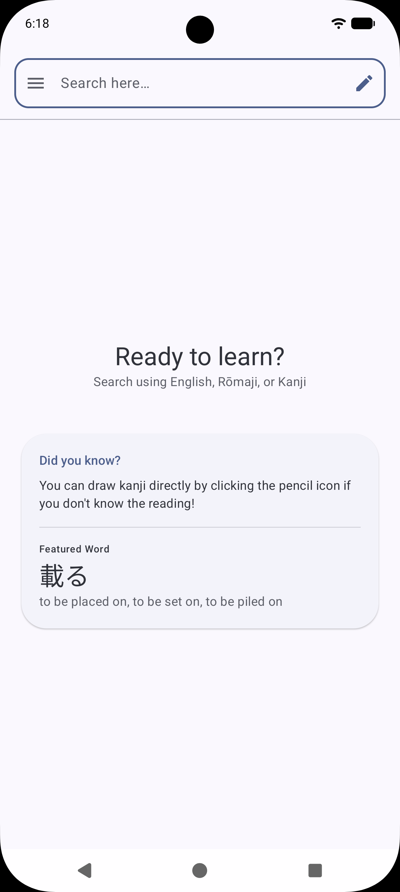
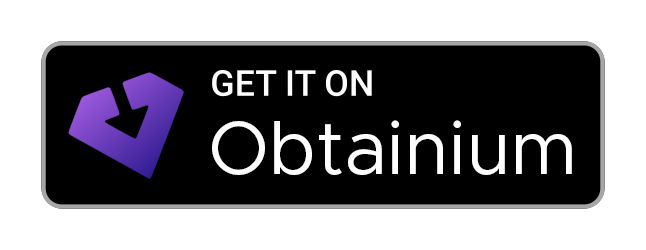

   
  
  <h1>Kantan</h1>

<h3>Kantan is an Open Source Japanese dictionary and learning tool for Android</h3>

  
  
  

# [Android will become a locked-down platform, FIGHT BACK!](https://keepandroidopen.org/)

## Installation

  
  

## App Description

TODO

## Security & Verification

To ensure the integrity of the app, you can verify the signing certificate fingerprint. This
fingerprint should match regardless of the version:

**Developer Certificate Fingerprint (SHA-256):**

TODO

**Package Name**

`dev.mariinkys.kantan`

### APK Verification

Every release includes a unique SHA-256 hash of the specific APK file in
the [Release Notes](https://github.com/mariinkys/kantan/releases). You can
use [AppVerifier](https://github.com/soupslurpr/AppVerifier) to compare the installed app against
these values.

## Copyright and Licensing

TODO: Add used files info

Copyright 2026 © Alex Marín

Released under the terms of the [GPL-3.0](./LICENSE)
