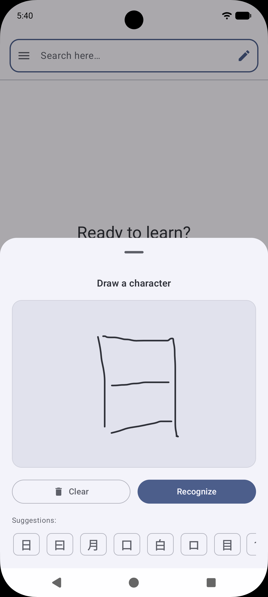
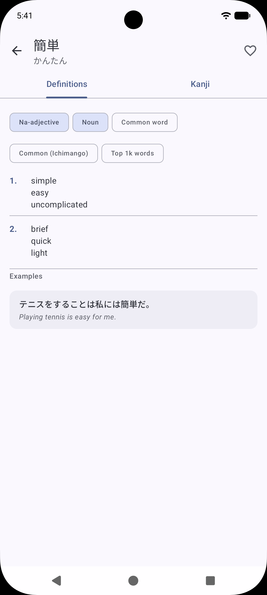
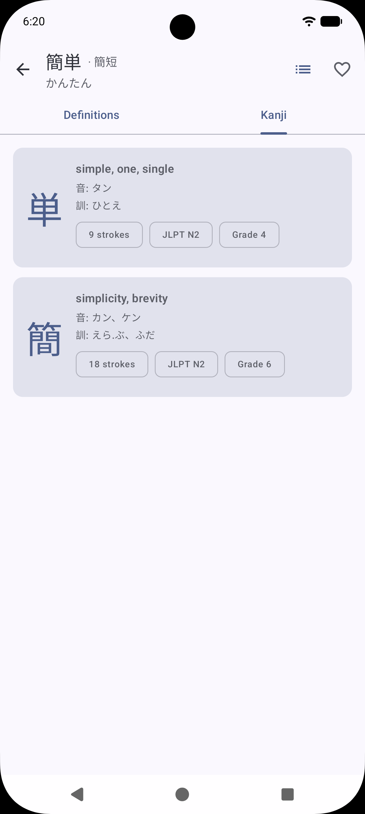
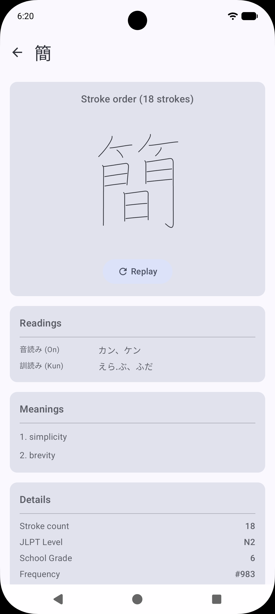
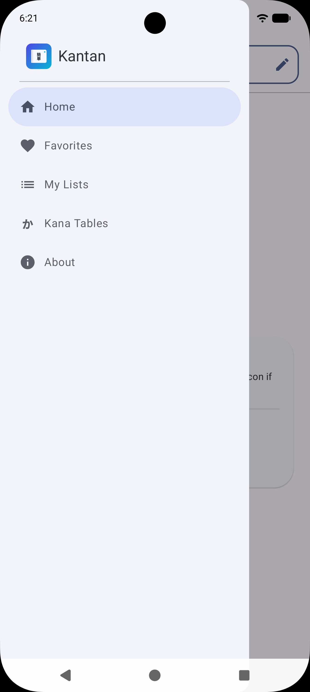

   
  
  <h1>Kantan</h1>

<h3>Kantan is an open-source Japanese dictionary and learning tool for Android</h3>

  
  
  
  
  
  

# [Android will become a locked-down platform, FIGHT BACK!](https://keepandroidopen.org/)

## Installation

  
  

## Build Variants

| Feature                   | **Full**            | **FOSS**     |
|:--------------------------|:--------------------|:-------------|
| **Google Play Services**  | Required            | Not Required |
| **Internet Access**       | Required (One-time) | Not Required |
| **Handwriting Detection** | Yes                 | No           |

The full app is recommended for most users.

## App Description

Kantan is a free and open source Japanese dictionary and learning tool designed to make studying
simple, intuitive, and accessible. Search right away using words (English), kanji, rōmaji, or even
by
drawing characters directly on your screen. From there, Kantan helps you explore meanings, readings,
and usage without friction. You can also easily review characters and practice recognition whenever
you like.

Kantan helps you learn Japanese your way—simply, effectively, and for free (no ads, fully open
source).

Features:

* Fast and reliable Japanese dictionary with word and kanji lookup
* Draw characters to search when you don’t know how to type them
* Add words to favorites and other custom lists
* Stroke-order diagrams to learn how to write kanji correctly
* Multiple readings and meanings for each entry
* Example sentences to understand context
* Clean, distraction-free interface designed for learning

## Security & Verification

To ensure the integrity of the app, you can verify the signing certificate fingerprint. This
fingerprint should match regardless of the version:

**Developer Certificate Fingerprint (SHA-256):**

`B0:02:1B:BA:B4:39:0B:92:32:2F:AC:E5:0F:11:88:DF:BA:40:61:8E:9E:DA:EF:E7:8B:01:63:29:B5:DB:D6:37`

**Package Name**

`dev.mariinkys.kantan`

### APK Verification

Every release includes a unique SHA-256 hash of the specific APK file in
the [Release Notes](https://github.com/mariinkys/kantan/releases). You can
use [AppVerifier](https://github.com/soupslurpr/AppVerifier) to compare the installed app against
these values.

## Copyright and Licensing

- The dictionary words and kanji come from the JMDict and KANJIDIC files owned by the
  Electronic Dictionary Research and Development Group ([www.edrdg.org](www.edrdg.org)), and are
  used in conformance with the Group's license.

- The example sentences come from the projects Tatoeba and Tanaka Corpus.

- The Kanji strokes information are from KanjiVG provided by Ulrich Apel
  at [kanjivg.tagaini.net](kanjivg.tagaini.net).

- Kantan specifically uses the JMDict and KANJIDIC files provided
  by [Yomitan](https://github.com/yomidevs/jmdict-yomitan)

Copyright 2026 © Alex Marín

Released under the terms of the [GPL-3.0](./LICENSE)
